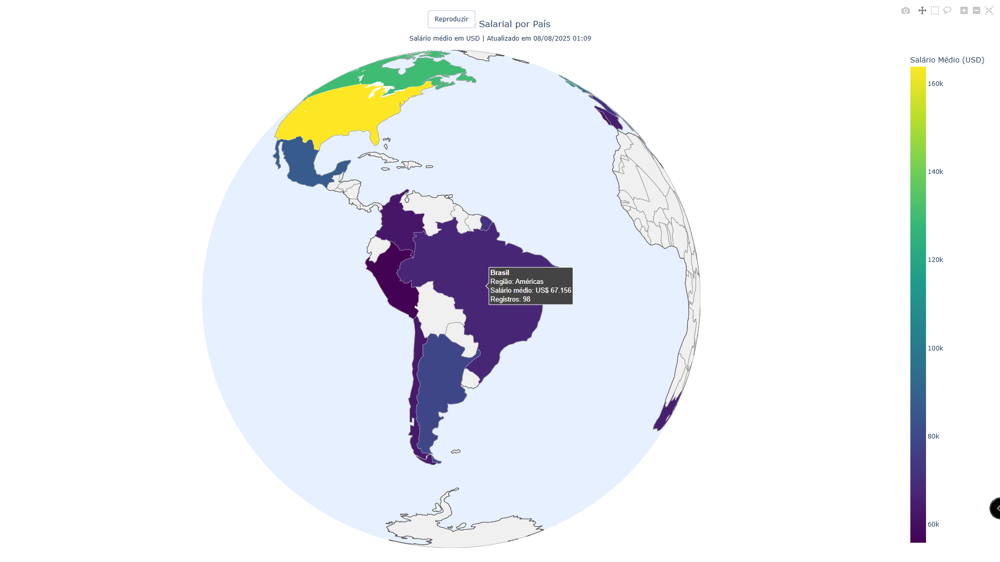

---

# Globo Salarial por País 🌍

Análise e visualização interativa do **salário médio em USD por país**, exibido em um **globo 3D (projeção ortográfica)** utilizando Plotly.

O sistema processa dados públicos da área de Ciência de Dados, calcula o salário médio por país (com filtro de amostra mínima), identifica a **região geográfica** e exibe a informação no hover do mapa.

---

## 📋 Funcionalidades

- **Carregamento automático** do dataset público de salários (fonte: GitHub).
- **Limpeza e preparação** dos dados com Pandas e NumPy.
- **Mapeamento geográfico** de países (ISO2 → ISO3) para uso no Plotly.
- **Cálculo de salário médio** por país, com filtro por quantidade mínima de registros.
- **Identificação da região** (Américas, Europa, Ásia-Pacífico, Oriente Médio/África).
- **Visualização interativa** em formato de globo 3D.
- **Hover personalizado** exibindo:
  - Nome do país
  - Região
  - Salário médio formatado
  - Número de registros

---

## 📂 Estrutura do Projeto

```

globo\_salarial/
├── globo\_salarial.py       # Script principal com todo o pipeline
├── requirements.txt        # Dependências do projeto
├── README.md               # Este arquivo
└── exemplo\_globo.png       # Imagem ilustrativa do resultado

````

---

## 🚀 Instalação

> **Pré-requisitos**: Python 3.9+ instalado.

1. Clone este repositório ou baixe o script:

```bash
git clone https://github.com/seu-usuario/globo-salarial.git
cd globo-salarial
````

2. Crie um ambiente virtual (opcional, mas recomendado):

```bash
python -m venv .venv
source .venv/bin/activate  # Linux/Mac
.venv\Scripts\activate     # Windows
```

3. Instale as dependências:

```bash
pip install -r requirements.txt
```

> **Conteúdo do `requirements.txt`:**
>
> ```
> pandas
> numpy
> plotly
> ```

---

## 💻 Uso

Execute o script diretamente no terminal:

```bash
python globo_salarial.py
```

O globo interativo abrirá automaticamente no seu navegador padrão.

---

## 📊 Exemplo de Resultado

**Visualização do Globo Salarial (Plotly):**



* **Cores** → Escala Viridis baseada no salário médio em USD.
* **Interatividade** → Você pode girar o globo, dar zoom e mover livremente.
* **Hover** → Mostra nome do país, região, salário médio e número de registros.

---

## ⚙️ Parâmetros Personalizáveis

No script, a função `load_and_prepare()` permite ajustes:

```python
data = load_and_prepare(
    data_source=DEFAULT_DATA_URL,  # Fonte dos dados
    min_samples_per_country=5      # Mínimo de registros por país
)
```

* `data_source` → Pode ser URL ou caminho para CSV local.
* `min_samples_per_country` → Evita ruído de países com poucos registros.

---

## 📈 Fontes de Dados

* Dataset original: [guilhermeonrails/data-jobs](https://github.com/guilhermeonrails/data-jobs)
* Colunas originais traduzidas para português para facilitar análise.

---

## 🛠 Tecnologias Utilizadas

* **Python 3.9+**
* **Pandas** → Manipulação e limpeza de dados
* **NumPy** → Operações numéricas
* **Plotly** → Visualização interativa
* **Logging** → Mensagens e status do processamento

---

## ✨ Autor

Desenvolvido por **[Enoque Sousa](https://www.linkedin.com/in/enoque-sousa-bb89aa168/)**
Especialista em Python, Ciência de Dados e Visualização Interativa.
